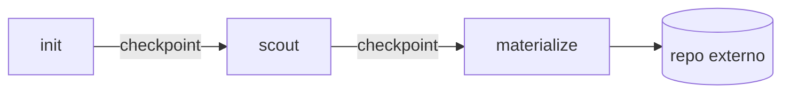
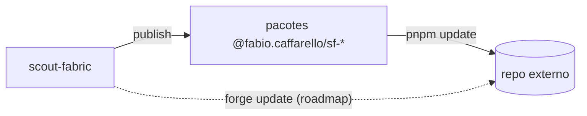

# scout-fabric — contexto

Mapa do projeto. Curto por design.

## O que é

Fábrica de projetos baseada em Nx que gera repos independentes de alta
qualidade. A fábrica **publica pacotes** no npm; os projetos gerados
nascem **fora** dela.

## Decisões tomadas

- **Topologia B** — monorepo-fábrica publica em npm; projetos gerados são
  **repos externos**, com release próprio (cada time controla quando
  consumir um bump).
- **Modo TS Solution (package-based)** do Nx 22 — nativo do preset `ts`,
  sem migração. `composite` + project references + `customConditions`.
- **Inteligência num plugin Nx próprio** (`@fabio.caffarello/sf-plugin`) —
  generators, executors e migrations. A CLI da fábrica é Nx.
- **Design system externo** — `@fabio.caffarello/react-design-system` vive
  em repo apartado, consumido via npm. Nunca contido aqui.
- **Duas naturezas de herança:**
  1. **Por versão de pacote** — bump em `sf-*` publicado alcança projetos
     externos no próximo `pnpm update`.
  2. **Por transformação de código** — `nx migrate` aqui dentro; para
     externos virá `forge update` (roadmap).
- **Fluxo em três fases, com checkpoints:** `init → scout → materialize`.
- **Scout determinístico** — escolhe de catálogo fixo. Specs em Markdown
  com frontmatter YAML (prosa para humano + bloco para generators).
- **Contrato de zonas (`init` → `materialize`)** — entre essas fases, o
  `.claude/` de um projeto-filho **será** escrito apenas pela fábrica
  (nunca editado à mão pelo operador). O `materialize` **deverá** honrar
  `zona-app` (regime create, sobrescrita-segura) e `zona-.claude` (regime
  patch), e parar via guarda de sanidade se o disco divergir. Fundamento
  e alternativas em [`../audit/05-decisoes-tomadas-adr.md`](../audit/05-decisoes-tomadas-adr.md) (decisão #6).
- **Naming** — publicáveis sob `@fabio.caffarello/sf-<pkg>`; condition
  interna `@scout-fabric/source` (dev-time, nunca publicada).
- **Stack** — pnpm 10, Husky v9 + lint-staged, conventional commits.

## Estado atual

**Foundation (camada 0):**

- Workspace Nx 22.7.5, TS 5.9, modo TS Solution.
- `tsconfig.base.json` estrito (inclui `noUncheckedIndexedAccess`).
- ESLint 9 flat + `@nx/eslint-plugin` (com `enforce-module-boundaries`
  como placeholder) + `typescript-eslint`. Prettier explícito
  (`printWidth=100`, `trailingComma=all`, `semi`, `lf`). ESLint e Prettier
  separados via `eslint-config-prettier`.
- Husky v9 ativo: `pre-commit` roda `lint-staged`; `commit-msg` roda
  `commitlint` (conventional).
- Node pin — `.nvmrc=24`, `engines.node: ">=22.0.0"`.
- `nx.json` com `namedInputs.production` excluindo testes/configs de
  runner, `sharedGlobals` modelando os arquivos cross-workspace,
  `targetDefaults.test` semeado.

**Pacotes (camada 0.9 + 3):** três pacotes vivos.

- `packages/sf-tsconfig` — TS configs base reusáveis
  (`base.json` + `lib.json`).
- `packages/sf-eslint-config` — flat config ESLint compartilhada
  (presets Nx, regras opinativas, `eslint-config-prettier`). O
  `eslint.config.mjs` raiz é um **stub fino** que estende esse pacote
  via `import sf from '@fabio.caffarello/sf-eslint-config'` (consumido
  via `workspace:*`) e acrescenta apenas o que é workspace-specific
  (typed-lint com `projectService`, `enforce-module-boundaries` com
  `depConstraints`).
- `packages/sf-plugin` — Nx plugin (host de generators). Hoje tem
  `marker` (probe de infraestrutura) e `webapp` (gerador real que delega
  a `create-next-app` + harness RDS). É a CLI da fábrica —
  `nx g @fabio.caffarello/sf-plugin:<name>` é a interface.

A workspace dep força Node a resolver pelo `default` do `exports`,
ou seja, pelo `dist/`. Por isso `targetDefaults.lint.dependsOn` no
`nx.json` inclui `sf-eslint-config:build` — garante dist fresco antes
de qualquer lint.

Convenção para criar um novo `sf-*` — generator, ajustes obrigatórios,
pegadinhas do lockfile e peer deps contratuais — em
[`../conventions/package.md`](../conventions/package.md).

**Ferramental de desenvolvimento (`.claude/`):**

- Subagent `package-creator` (`.claude/agents/package-creator.md`) —
  encapsula a convenção de criação de pacote num roteiro repetível.
  Não publica, não comita, não abre PR.
- Skills finas (`.claude/skills/<name>/SKILL.md`):
  - `validate` → `nx affected -t lint typecheck test build`.
  - `smoke-publish` → `tools/smoke-publish.sh`.
  - `governance` → `scripts/apply-branch-protection.sh` (dry-run
    default; `--apply` exige confirmação).
- Convenção: skill é fina, lógica vive no script. Mudar comportamento =
  mudar o script.

**CI (camada 1):** `.github/workflows/ci.yml` — 3 jobs (`format`,
`commit-msg`, `verify`) com `nx-set-shas`. PR roda `affected`; push em
`main` roda `run-many`. Branch protection na `main` exige os 3 checks.
Detalhes em [`ci.md`](../ci.md).

**Testes (camada C):** Vitest 4 via `@nx/vite/plugin`. `sf-tsconfig`
tem `test` target real (7 testes assertando shape de `base.json`/`lib.json`).
Coverage `v8`, reporters `text+html`, sem thresholds.

**Release (camada A):** ✅ provado / ⏳ pendente:

- ✅ `nx.json#release` configurado (independente + conventional commits +
  per-project changelog).
- ✅ `tools/smoke-publish.sh` prova `publish → install → use` contra
  Verdaccio local, com asserção comportamental (`noUncheckedIndexedAccess`
  falha como esperado no consumidor).
- ✅ `.github/workflows/release.yml` (manual) com job `dry-run` (sempre)
  e `smoke` (opt-in via input).
- ⏳ Publish real no npmjs: falta criar secret `NPM_TOKEN` (automation,
  scoped to `@fabio.caffarello/*`) e descomentar bloco em `release.yml`.
  Checklist em [`release.md`](../release.md).

**Governança (camada B):** ✅ provado / ⏳ pendente:

- ✅ `governance/branch-protection.main.json` versionado + script
  idempotente `scripts/apply-branch-protection.sh`. Detalhes em
  [`governance.md`](../governance.md).
- ✅ `.github/workflows/governance-drift.yml` — `workflow_dispatch` +
  cron semanal — detecta drift entre spec e estado live, **nunca aplica**.
- ⏳ Secret `GOVERNANCE_ADMIN_TOKEN` (PAT com `Repository administration: Read`).
  Sem ele, o drift check falha por permissão. Quando configurado, vira
  verde semanal.

## Roadmap

**Pendências operacionais** (não-software):

- `NPM_TOKEN` (automation, scope `@fabio.caffarello/*`) → ativa publish real.
- `GOVERNANCE_ADMIN_TOKEN` (PAT, `Repository administration: Read`) →
  ativa drift check verde.

**Mais à frente:**

- Catálogo de scout (estrutura, schemas, conteúdo).
- Kit de scout — subagents Claude, slash-commands.
- `forge update` — propagação de transformações a repos externos.

## Diagramas

### Três fases

### Duas naturezas de herança

