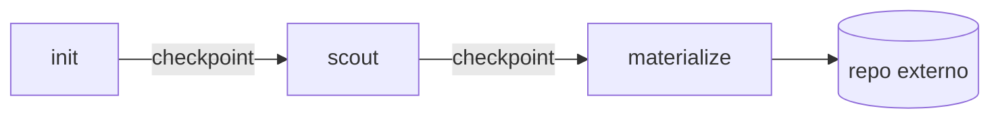
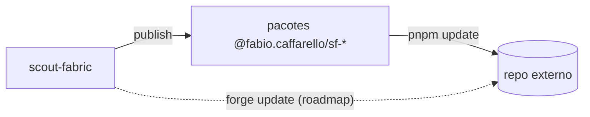

# scout-fabric — contexto

Mapa do projeto. Curto por design.

## O que é

Fábrica de projetos baseada em Nx que gera repos independentes de alta
qualidade. A fábrica **publica pacotes** no npm; os projetos gerados
nascem **fora** dela.

## Decisões tomadas

- **Topologia B** — monorepo-fábrica publica em npm; projetos gerados são
  **repos externos**, com release próprio (cada time controla quando
  consumir um bump).
- **Modo TS Solution (package-based)** do Nx 22 — nativo do preset `ts`,
  sem migração. `composite` + project references + `customConditions`.
- **Inteligência num plugin Nx próprio** (`@fabio.caffarello/sf-plugin`) —
  generators, executors e migrations. A CLI da fábrica é Nx.
- **Design system externo** — `@fabio.caffarello/react-design-system` vive
  em repo apartado, consumido via npm. Nunca contido aqui.
- **Duas naturezas de herança:**
  1. **Por versão de pacote** — bump em `sf-*` publicado alcança projetos
     externos no próximo `pnpm update`.
  2. **Por transformação de código** — `nx migrate` aqui dentro; para
     externos virá `forge update` (roadmap).
- **Fluxo em três fases, com checkpoints:** `init → scout → materialize`.
- **Scout determinístico** — escolhe de catálogo fixo. Specs em Markdown
  com frontmatter YAML (prosa para humano + bloco para generators).
- **Naming** — publicáveis sob `@fabio.caffarello/sf-<pkg>`; condition
  interna `@scout-fabric/source` (dev-time, nunca publicada).
- **Stack** — pnpm 10, Husky v9 + lint-staged, conventional commits.

## Estado atual

- Workspace Nx 22.7.5, TS 5.9, modo TS Solution.
- `tsconfig.base.json` estrito (inclui `noUncheckedIndexedAccess`).
- ESLint 9 flat + `@nx/eslint-plugin` (com `enforce-module-boundaries`
  como placeholder) + `typescript-eslint`. Prettier explícito
  (`printWidth=100`, `trailingComma=all`, `semi`, `lf`). ESLint e Prettier
  separados via `eslint-config-prettier`.
- Husky v9 ativo: `pre-commit` roda `lint-staged`; `commit-msg` roda
  `commitlint` (conventional).
- Node pin — `.nvmrc=24`, `engines.node: ">=22.0.0"`.
- **CI ativo** — `.github/workflows/ci.yml`: 3 jobs (`format`, `commit-msg`,
  `verify`) com `nx-set-shas` resolvendo `NX_BASE`/`NX_HEAD`. PR roda
  `affected`; push em `main` roda `run-many`. Detalhes em
  [`ci.md`](../ci.md).
- **Governança versionada** — proteção da `main` declarada em
  `governance/branch-protection.main.json`, aplicada por
  `scripts/apply-branch-protection.sh`. Detalhes em
  [`governance.md`](../governance.md).
- `packages/` contém `sf-tsconfig` (TS configs base re-utilizáveis).

## Roadmap

- **Primeiro publish real no npmjs** — falta só o `NPM_TOKEN` (automation,
  scope `@fabio.caffarello/*`) e descomentar o bloco em `release.yml`.
  Checklist em [`../release.md`](../release.md). Tudo o mais já está
  pronto e provado:
  - `nx.json#release` independente + conventional commits + per-project
    changelog.
  - Smoke `tools/smoke-publish.sh` prova `publish → install → use`
    contra Verdaccio local.
  - `.github/workflows/release.yml` (manual) roda `nx release --dry-run`
    e opcionalmente o smoke em CI.
- `@fabio.caffarello/sf-eslint-config`.
- `@fabio.caffarello/sf-plugin` — generators, executors, migrations.
- Catálogo de scout (estrutura, schemas, conteúdo).
- Kit de scout — subagents Claude, slash-commands.
- `forge update` — propagação de transformações a repos externos.

## Diagramas

### Três fases

### Duas naturezas de herança

